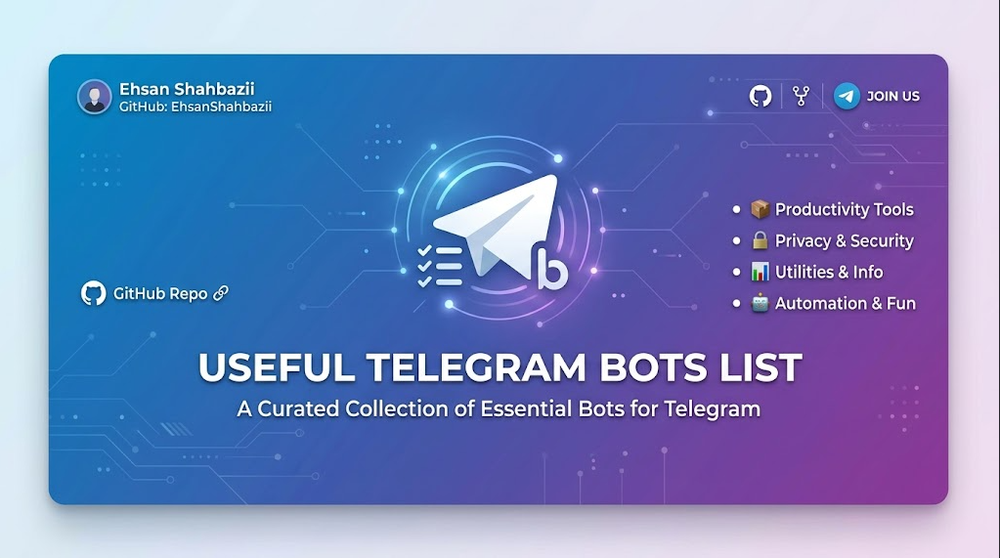

# 🤖 Useful Telegram Bots

A curated collection of the most useful, active, and high-performance Telegram bots to supercharge your messaging experience.

---

This repository is a curated catalog of Telegram bots designed to make your daily tasks easier—from downloading media, converting files, and reading RSS feeds, to learning languages, managing groups, and running code.

---

## 🧭 Table of Contents

- [⭐ Personal & Featured Choice](#-personal--featured-choice)
- [📥 Media & Social Downloaders](#-media--social-downloaders)
- [🎵 Music, Audio & Podcasts](#-music-audio--podcasts)
- [📚 Productivity & Utility Tools](#-productivity--utility-tools)
- [🔍 Search & Information Reference](#-search--information-reference)
- [💬 Translation, Language & Chat](#-translation-language--chat)
- [💻 Developers & Programming](#-developers--programming)
- [🍿 Movies, TV Shows & YouTube](#-movies-tv-shows--youtube)
- [🎨 Stickers, Themes & Logo Design](#-stickers-themes--logo-design)
- [📊 Network, Links & Server Info](#-network-links--server-info)
- [🛡️ Security, RSS & Finance](#-security-rss--finance)
- [🚀 How to Use & Contribute](#-how-to-use--contribute)

---

## ⭐ Personal & Featured Choice

These are highly recommended, daily-driver bots selected for their reliability, feature set, and excellent user experience:

- **[@RegaYoutube_Bot](https://t.me/RegaYoutube_Bot)** 🎥 — Direct downloader for YouTube videos and audios.
- **[@youtubejavanbot](https://t.me/youtubejavanbot)** 🎥 — Search and download YouTube videos easily.
- **[@Dl_CheetahBot](https://t.me/Dl_CheetahBot)** 🐆 — High-speed downloader for multiple media platforms.
- **[@download_it_bot](https://t.me/download_it_bot)** 📥 — Multi-platform downloader for videos and media files.
- **[@RegaSpotify_Bot](https://t.me/RegaSpotify_Bot)** 🎵 — Search and download tracks/playlists from Spotify.
- **[@RegaSoundCloud_Bot](https://t.me/RegaSoundCloud_Bot)** ☁️ — Download tracks directly from SoundCloud.
- **[@Regainstagram_Bot](https://t.me/Regainstagram_Bot)** 📸 — Download reels, posts, and stories from Instagram.
- **[@RegaTwitter_Bot](https://t.me/RegaTwitter_Bot)** 🐦 — Save videos and GIFs from Twitter/X.
- **[@RegaPinterest_Bot](https://t.me/RegaPinterest_Bot)** 📌 — Download images and videos from Pinterest.
- **[@RegaCastbot_Bot](https://t.me/RegaCastbot_Bot)** 🎙️ — Listen and download podcasts from Castbox.
- **[@RegaTikTok_Bot](https://t.me/RegaTikTok_Bot)** 🎵 — Download TikTok videos without watermarks.
- **[@cybercollectorbot](https://t.me/cybercollectorbot)** 🗃️ — Collect and download links and files from various sites.

---

## 📥 Media & Social Downloaders

### 📸 Instagram Media
- **[@Instasave_bot](https://t.me/Instasave_bot)** — Fast Instagram story and post downloader.
- **[@AnySaveBot](https://t.me/AnySaveBot)** — All-in-one saver for Instagram, TikTok, and more.
- **[@InstagramRobot](https://t.me/InstagramRobot)** — Save Instagram media via links.
- **[@InstaBot](https://t.me/InstaBot)** — Standard downloader for Instagram media.
- **[@inst8bot](https://t.me/inst8bot)** — Quick saver for Instagram posts and videos.
- **[@InstalnlineBot](https://t.me/InstalnlineBot)** — View Instagram posts inline inside any chat.
- **[@InstaFetchBot](https://t.me/InstaFetchBot)** — Fetch and view media from Instagram profiles.
- **[@Regrambot](https://t.me/Regrambot)** — Repost and see Instagram content without leaving Telegram.

### 🤖 Facebook & Video Downloader
- **[@FBvidzBot](https://t.me/FBvidzBot)** — Download and save Facebook videos.

### 📱 App Downloaders
- **[@Apkdl_bot](https://t.me/Apkdl_bot)** — Search and download Android APK packages.
- **[@UptodownBot](https://t.me/UptodownBot)** — Downloader for apps from the Uptodown store.
- **[@AppFollowBot](https://t.me/AppFollowBot)** — Track app store reviews, ratings, and rankings.
- **[@G0Bot](https://t.me/G0Bot)** — Search Google Play store applications.

---

## 🎵 Music, Audio & Podcasts

### 🎧 Music Downloaders
- **[@MyMusicBot](https://t.me/MyMusicBot)** — Large music search and downloader database.
- **[@Moozikestan_bot](https://t.me/Moozikestan_bot)** — Popular Iranian and international music downloader.
- **[@Scloud_bot](https://t.me/Scloud_bot)** — Search and download tracks from SoundCloud.
- **[@MusicLinkBot](https://t.me/MusicLinkBot)** — Convert music links between Spotify, Apple Music, and YouTube.
- **[@The_MusicBot](https://t.me/The_MusicBot)** — General search and download tool for audio files.
- **[@MP3sBot](https://t.me/MP3sBot)** — Search and download MP3 music tracks.
- **[@GetMusicBot](https://t.me/GetMusicBot)** — Search music from YouTube and download as MP3.
- **[@vkm_bot](https://t.me/vkm_bot)** — Popular VK Music database search and downloader.
- **[@Mp3robot](https://t.me/Mp3robot)** — Search, play, and download MP3s.
- **[@BeatSpotBot](https://t.me/BeatSpotBot)** — Discover and download EDM and other music tracks.
- **[@Spotifybot](https://t.me/Spotifybot)** — Search and share Spotify tracks inline.
- **[@TakeyourmusicBot](https://t.me/TakeyourmusicBot)** — High-quality music download utility.
- **[@BingMusicBot](https://t.me/BingMusicBot)** — Find music using Bing search.
- **[@vkm4bot](https://t.me/vkm4bot)** — Alternative VK Music search and downloader.

### 🔍 Music Identification & Search
- **[@Melobot](https://t.me/Melobot)** — Find music by humming, singing, or lyrics.
- **[@Acknobot](https://t.me/Acknobot)** — Shazam-like music identification bot.
- **[@Music](https://t.me/Music)** — Find and play classical and popular music tracks.

### 📝 Lyrics
- **[@iLyricsBot](https://t.me/iLyricsBot)** — Find lyrics for your favorite songs instantly.
- **[@LyricsGramBot](https://t.me/LyricsGramBot)** — Search song lyrics directly in chats.

### ✂️ Audio Editing
- **[@id3bot](https://t.me/id3bot)** — Edit MP3 metadata tags, album art, and titles.
- **[@Mp3toolsbot](https://t.me/Mp3toolsbot)** — Cut, edit, and convert MP3 audio files.
- **[@Mp3EditBot](https://t.me/Mp3EditBot)** — Simple tag and file editor for MP3s.
- **[@SetTagBot](https://t.me/SetTagBot)** — Edit metadata and tags of audio files.

### 📻 Radio Archive
- **[@RadioArchiveBot](https://t.me/RadioArchiveBot)** — Listen to historical and live radio archives.

---

## 📚 Productivity & Utility Tools

### 🔗 Link Shorteners & Managers
- **[@ShortUrlBot](https://t.me/ShortUrlBot)** — Instantly shorten long URLs.
- **[@Shorturl_googl_bot](https://t.me/Shorturl_googl_bot)** — URL shortener using Google's engine.
- **[@Urlprobot](https://t.me/Urlprobot)** — Advanced URL shortener with analytics.
- **[@ShorrtltBot](https://t.me/ShorrtltBot)** — Simple, fast link shortener.
- **[@ylinkpro_bot](https://t.me/ylinkpro_bot)** — Shorten and track link statistics.
- **[@TelgrmlBot](https://t.me/TelgrmlBot)** — Generate short telegram-friendly redirect links.
- **[@LinkGeneratorBot](https://t.me/LinkGeneratorBot)** — Generate shortened links for files and pages.
- **[@MinyGa_Bot](https://t.me/MinyGa_Bot)** — Lightweight URL shortener.
- **[@Referbot](https://t.me/Referbot)** — Generate referral links and track referrals.
- **[@Resolvemebot](https://t.me/Resolvemebot)** — Expand shortened links to verify the actual destination.

### 🖼️ QR Codes
- **[@TheQRbot](https://t.me/TheQRbot)** — Generate and scan QR codes in seconds.
- **[@MakeQrBot](https://t.me/MakeQrBot)** — Create customizable QR codes from text or links.
- **[@QRQRbot](https://t.me/QRQRbot)** — A fast QR code reader and writer bot.

### 🧮 Calculators
- **[@CalcuBot](https://t.me/CalcuBot)** — Perform mathematical calculations directly in chat.
- **[@kalkulbot](https://t.me/kalkulbot)** — Advanced calculator bot with scientific functions.
- **[@MACLBot](https://t.me/MACLBot)** — Multi-functional math calculator and algebraic assistant.

### 📓 Notes, To-Dos & Bookmarks
- **[@BNoteBot](https://t.me/BNoteBot)** — Simple notepad for writing and saving quick notes.
- **[@Notepadbot](https://t.me/Notepadbot)** — Save notes and draft lists inside Telegram.
- **[@DoToBot](https://t.me/DoToBot)** — Create to-do lists and simple task managers.
- **[@Bookmarchbot](https://t.me/Bookmarchbot)** — Bookmark links, photos, and messages.
- **[@OrganizerRobot](https://t.me/OrganizerRobot)** — Organize files, lists, and links.
- **[@GoogleBookmarkBot](https://t.me/GoogleBookmarkBot)** — Sync and manage Google Bookmarks.

### 📖 Book Library & Readers
- **[@eBukBot](https://t.me/eBukBot)** — Search and download EPUB/PDF books.
- **[@Pdfobot](https://t.me/Pdfobot)** — Read, convert, and manage PDF books.
- **[@Bookinator_bot](https://t.me/Bookinator_bot)** — Extensive digital library for books and novels.
- **[@BuchBookBot](https://t.me/BuchBookBot)** — Search and read books directly in Telegram.

---

## 🔍 Search & Information Reference

### 🌐 Wikipedia
- **[@Wiki](https://t.me/Wiki)** — The official inline bot to search Wikipedia.
- **[@Wikishbot](https://t.me/Wikishbot)** — Quick search and read articles from Wikipedia.
- **[@WikiBotBot](https://t.me/WikiBotBot)** — Wikipedia assistant for looking up definitions and articles.

### 🔎 Internet Search & News
- **[@GoogleDEBot](https://t.me/GoogleDEBot)** — Google search bot (German/European search index).
- **[@GoogramBot](https://t.me/GoogramBot)** — Simple inline Google Search utility.
- **[@GoogleNews_bot](https://t.me/GoogleNews_bot)** — Stay updated with the latest headlines from Google News.
- **[@BingNewsBot](https://t.me/BingNewsBot)** — Daily headlines and news from Bing.

### 🖼️ Image Search
- **[@Bing](https://t.me/Bing)** — Search Bing images and web contents inline.
- **[@Pic](https://t.me/Pic)** — Quick image search bot.
- **[@imagebot](https://t.me/imagebot)** — Search and send images based on keywords.
- **[@imagesearchbot](https://t.me/imagesearchbot)** — Image search engine inside Telegram.
- **[@Googleimgbot](https://t.me/Googleimgbot)** — Search images using Google Search.
- **[@BingImageBot](https://t.me/BingImageBot)** — Find images on Bing.
- **[@ImageFetcherBot](https://t.me/ImageFetcherBot)** — Automatically fetches high-quality images.

### 🎬 GIF Search
- **[@GIFsearchRobot](https://t.me/GIFsearchRobot)** — Fast GIF search utility.
- **[@Gif](https://t.me/Gif)** — The official inline bot to search GIFs powered by Tenor.
- **[@Tenorbot](https://t.me/Tenorbot)** — Search Tenor's massive GIF library.
- **[@Guggybot](https://t.me/Guggybot)** — Add custom texts to GIFs and memes.

### 📖 Dictionaries & Word Reference
- **[@Vajehyabbot](https://t.me/Vajehyabbot)** — Popular Persian dictionary (Vajehyab) bot.
- **[@Oxf_dict_bot](https://t.me/Oxf_dict_bot)** — Look up word definitions using the Oxford Dictionary.
- **[@Dictrobot](https://t.me/Dictrobot)** — Fast multilingual dictionary bot.
- **[@Multitran_bot](https://t.me/Multitran_bot)** — Professional translation dictionary (Multitran).
- **[@JapanDicBot](https://t.me/JapanDicBot)** — Japanese dictionary and language helper.

---

## 💬 Translation, Language & Chat

### 🗣️ Translators
- **[@Translate_robot](https://t.me/Translate_robot)** — Translate messages into multiple languages.
- **[@TransisBot](https://t.me/TransisBot)** — Multi-language translator supporting voice and text.
- **[@ABot](https://t.me/ABot)** — Simple translator bot for inline translations.
- **[@Interpretbot](https://t.me/Interpretbot)** — Translator and interpreter assistant for chats.
- **[@Insttraslatebot](https://t.me/Insttraslatebot)** — Fast instant translation bot.
- **[@YTranslateBot](https://t.me/YTranslateBot)** — Yandex-powered high-quality translator.
- **[@Perevodbot](https://t.me/Perevodbot)** — Direct Russian/English translation bot.
- **[@Novindictionarybot](https://t.me/Novindictionarybot)** — Persian and English dictionary/translator.

### 🇬🇧 English Learning & Telegram Languages
- **[@AndyRobot](https://t.me/AndyRobot)** — Conversational bot to practice and learn English.
- **[@langbot](https://t.me/langbot)** — Set and manage custom Telegram languages.

### 🕵️ Incognito / Anonymous Chat
- **[@ChatIncognito](https://t.me/ChatIncognito)** — Chat anonymously with random strangers.
- **[@Gpschatbot](https://t.me/Gpschatbot)** — Connect with random chat partners near your location.

---

## 💻 Developers & Programming

### 📦 JSON Debugging
- **[@JsonDumpBot](https://t.me/JsonDumpBot)** — Dump raw JSON data of any Telegram message.
- **[@Returnjsonbot](https://t.me/Returnjsonbot)** — Echo message details back to you in JSON format.
- **[@ShowJsonBot](https://t.me/ShowJsonBot)** — View the behind-the-scenes JSON structure of Telegram messages.

### 💻 Code Testing & Formatting
- **[@Rextester_bot](https://t.me/Rextester_bot)** — Run and test code snippets in 30+ programming languages.
- **[@YogurLBot](https://t.me/YogurLBot)** — Pastebin-like tool to upload and share source text.
- **[@SyntaxHighlightBot](https://t.me/SyntaxHighlightBot)** — Format raw code with pretty syntax highlighting.
- **[@LibrariesBot](https://t.me/LibrariesBot)** — Search packages and libraries across different languages.

---

## 🍿 Movies, TV Shows & YouTube

### 🎬 Movie Databases & Trackers
- **[@imdb](https://t.me/imdb)** — Official/unofficial IMDb search bot for movie ratings.
- **[@MovieReleaseBot](https://t.me/MovieReleaseBot)** — Notify you when new movies and serials are released.
- **[@MovieS4Bot](https://t.me/MovieS4Bot)** — Search and get streaming links for movies.
- **[@Filmsearchbot](https://t.me/Filmsearchbot)** — Discover new movies and get detail lists.

### 📥 Movie Downloaders & Catalogs
- **[@Amdbbot](https://t.me/Amdbbot)** — Search movie databases and get reviews.
- **[@intermediabot](https://t.me/intermediabot)** — Media and movie index search assistant.
- **[@Vidusbot](https://t.me/Vidusbot)** — Video and movie search library.
- **[@KinonetBot](https://t.me/KinonetBot)** — Find movies and download directly inside Telegram.
- **[@TVSeriesRoBot](https://t.me/TVSeriesRoBot)** — Track and download TV episodes.

### 📺 YouTube Search & Downloader
- **[@Vid](https://t.me/Vid)** — Official inline bot to search and share YouTube videos.
- **[@Youtube](https://t.me/Youtube)** — Manage your YouTube account and search videos.
- **[@YtWatchBot](https://t.me/YtWatchBot)** — Watch YouTube videos without ads or external links.
- **[@Utubebot](https://t.me/Utubebot)** — High-speed YouTube downloader.
- **[@SaveVideoBot](https://t.me/SaveVideoBot)** — Video downloader from YouTube and other sites.
- **[@YoutubeConvertBot](https://t.me/YoutubeConvertBot)** — Convert YouTube videos to MP3 or MP4 formats.
- **[@MeTubeBot](https://t.me/MeTubeBot)** — Personal YouTube video saver and player.
- **[@iVideoBot](https://t.me/iVideoBot)** — Download video media from web links.
- **[@uVidBot](https://t.me/uVidBot)** — Fast video downloader.
- **[@YotBot](https://t.me/YotBot)** — Simple downloader for YouTube links.

---

## 🎨 Stickers, Themes & Logo Design

### 🎭 Sticker Search & Generators
- **[@Stickers](https://t.me/Stickers)** — Official Telegram sticker creation bot.
- **[@Demybot](https://t.me/Demybot)** — Popular sticker generator and editor.
- **[@Sticker](https://t.me/Sticker)** — Search and download existing stickers.
- **[@FStikBot](https://t.me/FStikBot)** — Custom sticker search and pack manager.
- **[@EzStickerBot](https://t.me/EzStickerBot)** — Create stickers from images effortlessly.

### 🔄 Sticker Converters
- **[@Stickerdownloadbot](https://t.me/Stickerdownloadbot)** — Extract images from Telegram sticker packs.
- **[@StickerToPhoto_Bot](https://t.me/StickerToPhoto_Bot)** — Convert stickers back into regular photos.
- **[@St2imgbot](https://t.me/St2imgbot)** — Simple sticker-to-image converter bot.
- **[@Pic2stcbot](https://t.me/Pic2stcbot)** — Convert photos to stickers instantly.
- **[@BuildStickerBot](https://t.me/BuildStickerBot)** — Assemble sticker packs using your own images.

### ✍️ Text-to-Sticker & Math Fonts
- **[@FonthaBot](https://t.me/FonthaBot)** — Convert normal text to custom sticker styles.
- **[@LatexBot](https://t.me/LatexBot)** — Render mathematical equations using LaTeX to images.
- **[@Segoeuibot](https://t.me/Segoeuibot)** — Generate Segoe UI font sticker styling.

### 🎨 Themes & Logo Design
- **[@Tthemebot](https://t.me/Tthemebot)** — Create, edit, and search custom Telegram themes.
- **[@VideoTMBot](https://t.me/VideoTMBot)** — Create video thumbnails and logos.
- **[@LogogramBot](https://t.me/LogogramBot)** — Design custom logos and emblems.
- **[@atxBot](https://t.me/atxBot)** — Dynamic text-based logo designer.

### 🎞️ GIF Creation
- **[@Gifcreator_bot](https://t.me/Gifcreator_bot)** — Create high-quality animated GIFs from photos.
- **[@Vgifibot](https://t.me/Vgifibot)** — Convert video files to Telegram-friendly GIFs.

---

## 📊 Network, Links & Server Info

### 🖥️ IP & Site Analysis
- **[@Whooisbot](https://t.me/Whooisbot)** — Lookup domain WHOIS information and registration.
- **[@Whois_Bot](https://t.me/Whois_Bot)** — Domain ownership and hosting registry checker.
- **[@DynahBot](https://t.me/DynahBot)** — Check status, redirects, and metadata of links.
- **[@ipinfoioBot](https://t.me/ipinfoioBot)** — Retrieve geolocation, ISP, and host details of an IP address.
- **[@ReadmeBot](https://t.me/ReadmeBot)** — Extract text, values, and articles from web pages.
- **[@Previews](https://t.me/Previews)** — Request instant preview cards of links.

### 🆔 Telegram ID & Info Retrievers
- **[@Userinfobot](https://t.me/Userinfobot)** — Get user info, user ID, and account details.
- **[@Get_id_bot](https://t.me/Get_id_bot)** — Retrieve user ID or chat ID instantly.
- **[@ShowIDBot](https://t.me/ShowIDBot)** — Simple ID retriever for users and groups.
- **[@Getidsbot](https://t.me/Getidsbot)** — Detailed ID information for channels, groups, and users.
- **[@ChannelldBot](https://t.me/ChannelldBot)** — Retrieve any Telegram channel's unique ID.
- **[@GroupIDbot](https://t.me/GroupIDbot)** — Find the unique ID of any group chat.
- **[@U3erbot](https://t.me/U3erbot)** — Get detailed info of usernames and accounts.
- **[@Usinfobot](https://t.me/Usinfobot)** — Retrieve account metadata and user information.
- **[@UserStoreBot](https://t.me/UserStoreBot)** — Store and organize user profiles and usernames.
- **[@MyAddressBookBot](https://t.me/MyAddressBookBot)** — Save, organize, and manage Telegram usernames.

### 📹 Traffic & Road Cameras
- **[@TrafficImage_bot](https://t.me/TrafficImage_bot)** — Check real-time road traffic camera images.
- **[@Web_cam_bot](https://t.me/Web_cam_bot)** — View live feeds from public cameras around the world.

---

## 🛡️ Security, RSS & Finance

### 📰 RSS Feed Readers
- **[@Telefeedbot](https://t.me/Telefeedbot)** — Fetch and read RSS feed updates in chats.
- **[@TheFeedReaderBot](https://t.me/TheFeedReaderBot)** — Fully-featured RSS reader bot for channels.
- **[@Treaderbot](https://t.me/Treaderbot)** — Clean and fast RSS reader utility.
- **[@AximoBot](https://t.me/AximoBot)** — RSS feed publisher and automated poster.
- **[@pstrbot](https://t.me/pstrbot)** — Feed reader and auto-poster for social links.
- **[@Feedler_bot](https://t.me/Feedler_bot)** — Elegant reader for RSS and website updates.
- **[@Junction_bot](https://t.me/Junction_bot)** — Aggregate multiple RSS feeds and channels into one feed.
- **[@Channelrushbot](https://t.me/Channelrushbot)** — Forward and customize RSS feeds to Telegram channels.

### 💰 Payments, Crypto & Wallets
- **[@ShopBot](https://t.me/ShopBot)** — Demo payment bot to show Telegram payment capabilities.
- **[@TelegramDonate](https://t.me/TelegramDonate)** — Official donation bot for channels and creators.
- **[@Octopocket_bot](https://t.me/Octopocket_bot)** — Crypto wallet and payment gateway within Telegram.
- **[@BTC_Change_Bot](https://t.me/BTC_Change_Bot)** — Exchange and trade Bitcoin safely.
- **[@Info_token_bot](https://t.me/Info_token_bot)** — Check token prices, contract addresses, and crypto data.

### 🔗 Integrations & Automation
- **[@IFTTT](https://t.me/IFTTT)** — Official If This Then That integration for Telegram.

### 👥 Group Moderation & Mention Tools
- **[@EveryoneTheBot](https://t.me/EveryoneTheBot)** — Tag all members in a group chat easily.
- **[@Hash_tag_bot](https://t.me/Hash_tag_bot)** — Set warnings and custom text for specific hashtags.
- **[@MasterTagAlertBot](https://t.me/MasterTagAlertBot)** — Admin tool to alert and notify group members.
- **[@TagAlertBot](https://t.me/TagAlertBot)** — Simple alert manager for tags and hashtags.

### ⚽ Sports & News Alerts
- **[@LiveRobot](https://t.me/LiveRobot)** — Real-time sports news, scores, and updates.
- **[@pouyanbot](https://t.me/pouyanbot)** — Comprehensive Persian/International sport news bot.

---

## 🚀 How to Use & Contribute

### How to Start a Bot
1. Click on the bot username link (e.g., [@RegaYoutube_Bot](https://t.me/RegaYoutube_Bot)).
2. This will open the bot in your Telegram app.
3. Click the **Start** button at the bottom of the chat to activate it.

### How to Contribute
We welcome contributions to make this list even better! If you know of a useful Telegram bot:
1. Fork this repository.
2. Add your bot to the appropriate category in `README.md`.
3. Provide a brief description of what the bot does.
4. Open a Pull Request!

---

*Curated with ❤️ by Ehsan.*
