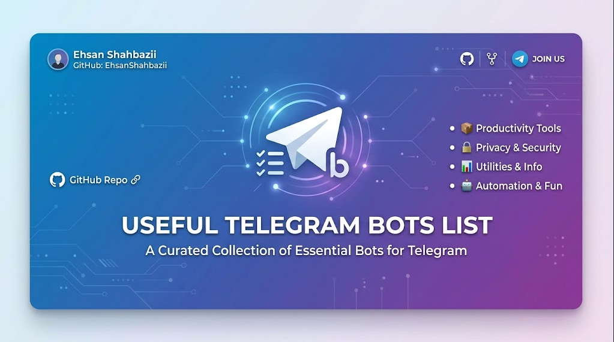

# 🤖 Useful Telegram Bots

A curated, verified, and high-performance collection of the most useful Telegram bots to supercharge your messaging workflow.

[](https://t.me/BotFather)
&nbsp;[](#automated-health-checker)
&nbsp;[](https://github.com/sindresorhus/awesome)
&nbsp;[](CONTRIBUTING.md)
&nbsp;[](LICENSE)

---



Welcome to the ultimate directory of Telegram bots! Every single bot in this repository is **programmatically verified** for active liveness. From generative AI assistants and voice transcription to universal file conversion, social media downloading, and DevOps utilities, these bots eliminate repetitive tasks right inside your chats.

> 🌐 **Interactive Web Directory**: Browse, filter, and search this list with live instant search on [GitHub Pages](https://ehsanshahbazii.github.io/Usefull-Telegram-Bots/).

---

## 🧭 Table of Contents

- [🤖 AI, LLMs & Speech-to-Text](#ai-llms-speech-to-text) `(6)`
- [🔄 File, Document & PDF Converters](#file-document-pdf-converters) `(6)`
- [📥 Media, Video & Social Downloaders](#media-video-social-downloaders) `(29)`
- [🎵 Music, Audio & Podcasts](#music-audio-podcasts) `(25)`
- [🍿 Movies, TV Shows & Streaming](#movies-tv-shows-streaming) `(11)`
- [🧲 Cloud Storage, Torrent & Web Uploader](#cloud-storage-torrent-web-uploader) `(4)`
- [📖 Books, Readers & Document Libraries](#books-readers-document-libraries) `(2)`
- [🛡️ Privacy, Security & Disposable Email](#privacy-security-disposable-email) `(4)`
- [👥 Group Moderation & Administration](#group-moderation-administration) `(9)`
- [💻 Developers & DevOps Tools](#developers-devops-tools) `(13)`
- [📚 Productivity, Reminders & Everyday Tools](#productivity-reminders-everyday-tools) `(26)`
- [🔍 Search, Dictionaries & Reference](#search-dictionaries-reference) `(21)`
- [🌐 Translation & Language Learning](#translation-language-learning) `(9)`
- [🎨 Stickers, Themes & Visual Design](#stickers-themes-visual-design) `(15)`
- [📊 Telegram User & Channel Utilities](#telegram-user-channel-utilities) `(12)`
- [💰 Crypto, Finance & Payments](#crypto-finance-payments) `(6)`
- [⚽ Sports & Live Event Alerts](#sports-live-event-alerts) `(2)`
- [⭐ Featured Daily-Drivers](#featured-daily-drivers)
- [🧪 Automated Health Checker](#automated-health-checker)
- [🚀 How to Use & Contribute](#how-to-use-contribute)

---

## ⭐ Featured Daily-Drivers

A hand-picked shortlist of battle-tested, high-utility bots recommended for everyday messaging:

- **[@ChatGPT_Telegram_Bot](https://t.me/ChatGPT_Telegram_Bot)** 🧠 — Multipurpose AI assistant powered by GPT-4o.
- **[@voicybot](https://t.me/voicybot)** 🎙️ — Instant voice-to-text Whisper transcription for voice notes.
- **[@newfileconverterbot](https://t.me/newfileconverterbot)** 🔄 — Universal media, video, document, and audio converter.
- **[@pdfbot](https://t.me/pdfbot)** 📄 — Complete PDF editing suite (merge, split, compress, watermark).
- **[@CobaltDlBot](https://t.me/CobaltDlBot)** 🚀 — Ad-free, high-speed downloader for YouTube, Twitter, and TikTok.
- **[@SaveAsBot](https://t.me/SaveAsBot)** 📸 — High-fidelity Instagram post, reels, and story saver.
- **[@Spotify_down_bot](https://t.me/Spotify_down_bot)** 🎵 — 320kbps Spotify track & playlist downloader.
- **[@SeedrBot](https://t.me/SeedrBot)** 🧲 — Cloud torrent caching and direct streaming.
- **[@dropmailbot](https://t.me/dropmailbot)** 🛡️ — Disposable temporary email for signups and OTPs.
- **[@MissRose_bot](https://t.me/MissRose_bot)** 👥 — Gold standard group administration and spam defense.

---

## 🤖 AI, LLMs & Speech-to-Text
*State-of-the-art conversational AI assistants, LLM interfaces, image generators, and voice transcription tools.*

- **[@ChatGPT_Telegram_Bot](https://t.me/ChatGPT_Telegram_Bot)** — **ChatGPT Telegram** &nbsp; `AI` `GPT-4` `Coding` `Writing`  
  Feature-rich AI chat assistant powered by OpenAI GPT-4o / GPT-3.5 for queries, writing, and code debugging.
- **[@ChatGpt_Free_Bot](https://t.me/ChatGpt_Free_Bot)** — **ChatGPT Free** &nbsp; `AI` `Chat` `Assistant`  
  Quick access conversational AI for prompt answers, ideation, and explanations.
- **[@voicybot](https://t.me/voicybot)** — **Voicy** &nbsp; `Transcription` `Voice-to-Text` `Whisper` `Groups`  
  Industry-standard voice-to-text transcription engine using Whisper and Google Speech. Works in private and group chats.
- **[@TranscribeRobot](https://t.me/TranscribeRobot)** — **Transcribe Robot** &nbsp; `Audio` `Transcription` `Multilingual`  
  Accurate multilingual speech recognition bot for converting long audio messages and voice notes into text.
- **[@BingImageCreatorBot](https://t.me/BingImageCreatorBot)** — **Bing Image Generator** &nbsp; `AI Art` `DALL-E 3` `Images`  
  AI image generation bot powered by DALL-E 3 / Microsoft Designer. Generates 4 HD image variants per prompt.
- **[@Dalle3_bot](https://t.me/Dalle3_bot)** — **DALL-E 3 & Midjourney** &nbsp; `AI Art` `Midjourney` `Image Generation`  
  Generate realistic artwork and photos using advanced generative diffusion models directly inside Telegram.

---

## 🔄 File, Document & PDF Converters
*Universal file converters, PDF manipulation suites, document format transformations, and image optimizers.*

- **[@newfileconverterbot](https://t.me/newfileconverterbot)** — **File Converter** &nbsp; `Converter` `Universal` `Video` `Audio` `Docs`  
  Universal file converter supporting video (MP4, MKV), audio (MP3, WAV, FLAC), documents (PDF, DOCX, EPUB), and images.
- **[@pdfbot](https://t.me/pdfbot)** — **PDF Bot** &nbsp; `PDF` `Compress` `Merge` `Split` `Watermark`  
  Swiss Army knife for PDFs: merge multiple files, split pages, compress file size, extract images, add watermarks, and encrypt.
- **[@Office2pdf_bot](https://t.me/Office2pdf_bot)** — **Office2pdf** &nbsp; `Office` `PDF` `Docx` `Converter`  
  Converts Microsoft Office documents (DOC, DOCX, XLS, XLSX, PPT, PPTX) and LibreOffice files into high-fidelity PDFs.
- **[@compressimagebot](https://t.me/compressimagebot)** — **Compress Image** &nbsp; `Images` `Compression` `Optimizer`  
  Reduce image file sizes without sacrificing visible visual quality.
- **[@WatermarkBot](https://t.me/WatermarkBot)** — **Watermark Bot** &nbsp; `Images` `Branding` `Watermark`  
  Add custom watermarks, logos, or brand labels to your images and photos effortlessly.
- **[@Stickeroptimizerbot](https://t.me/Stickeroptimizerbot)** — **Sticker Optimizer** &nbsp; `Stickers` `Converter` `PNG` `WEBP`  
  Optimizes and formats PNG/WEBP pictures to exact Telegram sticker dimension and weight requirements.

---

## 📥 Media, Video & Social Downloaders
*High-speed downloaders for videos, stories, audio, and reels from YouTube, Instagram, TikTok, Twitter/X, Pinterest, and Reddit.*

- **[@CobaltDlBot](https://t.me/CobaltDlBot)** — **Cobalt DL** &nbsp; `Universal` `No-Ads` `HD` `YouTube` `TikTok`  
  Modern, ad-free media downloader powered by Cobalt. Supports YouTube, Twitter, TikTok, SoundCloud, and Reddit in HD.
- **[@SaveAsBot](https://t.me/SaveAsBot)** — **Save As Bot** &nbsp; `Instagram` `TikTok` `Pinterest` `Reels`  
  Top-rated saver for Instagram posts, reels, stories, TikTok videos without watermark, and Pinterest media.
- **[@allsaverbot](https://t.me/allsaverbot)** — **All Saver Bot** &nbsp; `Video` `Multi-Platform` `Social`  
  Multi-platform video downloader for YouTube, Instagram, Twitter/X, and Facebook.
- **[@ttsavebot](https://t.me/ttsavebot)** — **TT Save Bot** &nbsp; `TikTok` `No Watermark` `HD`  
  Download TikTok videos in high definition with watermark completely removed, plus extracted audio.
- **[@TwitterVid_Bot](https://t.me/TwitterVid_Bot)** — **Twitter (X) Video** &nbsp; `Twitter` `X` `Video` `GIF`  
  Extract and download videos and GIFs from any Twitter/X post at maximum quality.
- **[@RedditVideoDownloadBot](https://t.me/RedditVideoDownloadBot)** — **Reddit Video Downloader** &nbsp; `Reddit` `Video` `Audio`  
  Downloads Reddit video posts along with their merged native audio tracks in MP4 format.
- **[@PinterestDownloaderBot](https://t.me/PinterestDownloaderBot)** — **Pinterest Downloader** &nbsp; `Pinterest` `Photos` `Video`  
  Save high-resolution images, GIFs, and video pins directly from Pinterest links.
- **[@RegaYoutube_Bot](https://t.me/RegaYoutube_Bot)** — **Rega YouTube** &nbsp; `YouTube` `Video` `Audio`  
  Direct search and high-speed downloader for YouTube videos and audio files.
- **[@youtubejavanbot](https://t.me/youtubejavanbot)** — **YouTube Javan** &nbsp; `YouTube` `Search` `Downloader`  
  Fast YouTube video search engine and downloader with quality selection.
- **[@YtAudioBot](https://t.me/YtAudioBot)** — **YTAudio Bot** &nbsp; `YouTube` `MP3` `Music`  
  Converts YouTube video URLs into clean, high-bitrate MP3 audio tracks.
- **[@Dl_CheetahBot](https://t.me/Dl_CheetahBot)** — **DL Cheetah** &nbsp; `Multi-Platform` `Fast` `Media`  
  High-speed downloader for multiple media platforms and social networks.
- **[@download_it_bot](https://t.me/download_it_bot)** — **Download It** &nbsp; `Downloader` `Social`  
  All-in-one downloader bot for videos, images, and audio links.
- **[@Instasave_bot](https://t.me/Instasave_bot)** — **Instasave** &nbsp; `Instagram` `Stories` `Reels`  
  Download Instagram stories, highlights, IGTV, and carousels via public links.
- **[@AnySaveBot](https://t.me/AnySaveBot)** — **AnySave** &nbsp; `Universal` `Saver`  
  Universal media extractor for Instagram, TikTok, and web video links.
- **[@InstaSaverBot](https://t.me/InstaSaverBot)** — **Instagram Royal** &nbsp; `Instagram` `Captions` `Reels`  
  Fast Instagram post, story, and reel downloader with caption extraction.
- **[@Regainstagram_Bot](https://t.me/Regainstagram_Bot)** — **Rega Instagram** &nbsp; `Instagram` `Downloader`  
  Download reels, posts, and IGTV directly by sending Instagram links.
- **[@RegaTwitter_Bot](https://t.me/RegaTwitter_Bot)** — **Rega Twitter** &nbsp; `Twitter` `Videos`  
  Download videos and GIFs from Twitter/X links.
- **[@RegaPinterest_Bot](https://t.me/RegaPinterest_Bot)** — **Rega Pinterest** &nbsp; `Pinterest` `Media`  
  Fetch high-resolution pictures and video pins from Pinterest.
- **[@RegaTikTok_Bot](https://t.me/RegaTikTok_Bot)** — **Rega TikTok** &nbsp; `TikTok` `No Watermark`  
  Download clean TikTok videos without watermark.
- **[@FBvidzBot](https://t.me/FBvidzBot)** — **FBvidz** &nbsp; `Facebook` `Video`  
  Extract and save public Facebook videos in SD and HD resolutions.
- **[@Utubebot](https://t.me/Utubebot)** — **Utube Bot** &nbsp; `YouTube` `Video`  
  Download YouTube videos by link or inline search.
- **[@YoutubeConvertBot](https://t.me/YoutubeConvertBot)** — **YouTube Convert** &nbsp; `YouTube` `Converter` `MP3` `MP4`  
  Convert and download YouTube videos into MP3 or MP4 formats with custom bitrates.
- **[@MeTubeBot](https://t.me/MeTubeBot)** — **MeTube** &nbsp; `YouTube` `Stream` `Save`  
  Personal YouTube video manager, audio streamer, and downloader.
- **[@uVidBot](https://t.me/uVidBot)** — **uVid Bot** &nbsp; `Video` `Web`  
  Lightweight video downloader for web media links.
- **[@iVideoBot](https://t.me/iVideoBot)** — **iVideo Bot** &nbsp; `Video` `Links`  
  Download video files from web links directly to Telegram.
- **[@YotBot](https://t.me/YotBot)** — **YotBot** &nbsp; `YouTube` `Video`  
  Simple downloader for YouTube video links.
- **[@Apkdl_bot](https://t.me/Apkdl_bot)** — **Apkdl** &nbsp; `Android` `APK` `Apps`  
  Search and download Android APK packages directly into Telegram.
- **[@UptodownBot](https://t.me/UptodownBot)** — **Uptodown** &nbsp; `Android` `Uptodown` `Store`  
  Discover and download safe Android APKs from the Uptodown app marketplace.
- **[@AppFollowBot](https://t.me/AppFollowBot)** — **AppFollow** &nbsp; `App Store` `Analytics` `Reviews`  
  Track app store rankings, user reviews, and app analytics for iOS and Android.

---

## 🎵 Music, Audio & Podcasts
*Stream, identify, search, edit, and download high-quality audio tracks, Spotify playlists, and lyrics.*

- **[@Spotify_down_bot](https://t.me/Spotify_down_bot)** — **Spotify Downloader** &nbsp; `Spotify` `Music` `320kbps` `Metadata`  
  Convert Spotify track, album, and playlist links into 320kbps MP3s with full ID3 metadata and album covers.
- **[@vkmusic_bot](https://t.me/vkmusic_bot)** — **VK Music Bot** &nbsp; `VK Music` `Search` `MP3` `Streaming`  
  Massive music search engine with millions of high-quality tracks, artists, and charts.
- **[@vkm4bot](https://t.me/vkm4bot)** — **VKM4 Bot** &nbsp; `VK Music` `MP3` `Database`  
  Alternative high-performance VK music database search and audio downloader.
- **[@DeezerMusicBot](https://t.me/DeezerMusicBot)** — **Deezer Music** &nbsp; `Deezer` `FLAC` `HQ Audio`  
  Download FLAC / 320kbps MP3 audio directly from Deezer links with complete ID3 tags.
- **[@RegaSpotify_Bot](https://t.me/RegaSpotify_Bot)** — **Rega Spotify** &nbsp; `Spotify` `Downloader`  
  Fast Spotify music track and album downloader.
- **[@RegaSoundCloud_Bot](https://t.me/RegaSoundCloud_Bot)** — **Rega SoundCloud** &nbsp; `SoundCloud` `MP3`  
  Direct MP3 downloader for tracks and DJ sets on SoundCloud.
- **[@Scloud_bot](https://t.me/Scloud_bot)** — **Scloud Bot** &nbsp; `SoundCloud` `Search` `Music`  
  Search SoundCloud and download tracks with artist info and artwork.
- **[@MyMusicBot](https://t.me/MyMusicBot)** — **MyMusicBot** &nbsp; `Search` `MP3` `Database`  
  Large music search engine and MP3 downloader database.
- **[@Moozikestan_bot](https://t.me/Moozikestan_bot)** — **Moozikestan** &nbsp; `Music` `Charts` `Streaming`  
  Popular international and Iranian music search and streaming bot.
- **[@MP3sBot](https://t.me/MP3sBot)** — **MP3s Bot** &nbsp; `MP3` `Search`  
  Search and download MP3 music tracks instantly.
- **[@GetMusicBot](https://t.me/GetMusicBot)** — **GetMusicBot** &nbsp; `YouTube` `MP3` `Downloader`  
  Search audio tracks from YouTube and download high-quality MP3s.
- **[@Mp3robot](https://t.me/Mp3robot)** — **MP3 Robot** &nbsp; `Stream` `Audio` `MP3`  
  Search, stream, and download audio tracks right inside Telegram.
- **[@BeatSpotBot](https://t.me/BeatSpotBot)** — **BeatSpot** &nbsp; `EDM` `Electronic` `Music`  
  Discover, preview, and download EDM, electronic, and dance music.
- **[@MusicLinkBot](https://t.me/MusicLinkBot)** — **MusicLink** &nbsp; `Smart Links` `Cross-Platform` `Spotify` `Apple Music`  
  Cross-platform smart link converter: switch songs between Spotify, Apple Music, YouTube Music, and Deezer.
- **[@SongIDbot](https://t.me/SongIDbot)** — **Song ID** &nbsp; `Shazam` `Recognition` `Identify`  
  Shazam alternative on Telegram: identify any song from an audio clip or voice hum.
- **[@Melobot](https://t.me/Melobot)** — **Melobot** &nbsp; `Recognition` `Lyrics` `Humming`  
  Identify songs by humming, singing, sending audio snippets, or searching lyrics.
- **[@Acknobot](https://t.me/Acknobot)** — **Acknobot** &nbsp; `Recognition` `Audio Fingerprint`  
  Instant music identification tool powered by acoustic fingerprinting.
- **[@Music](https://t.me/Music)** — **Classical Music** &nbsp; `Classical` `Orchestra` `Music`  
  Discover, play, and explore classical and masterpiece compositions.
- **[@iLyricsBot](https://t.me/iLyricsBot)** — **iLyrics** &nbsp; `Lyrics` `Search`  
  Search and display synchronized song lyrics directly in any chat.
- **[@LyricsGramBot](https://t.me/LyricsGramBot)** — **LyricsGram** &nbsp; `Lyrics` `Text`  
  Find lyrics for songs by title, artist, or even a line of lyrics.
- **[@id3bot](https://t.me/id3bot)** — **id3bot** &nbsp; `ID3 Tags` `Editor` `Cover Art`  
  Edit MP3 ID3 tags: update song title, artist, album name, year, and embed custom album cover art.
- **[@Mp3toolsbot](https://t.me/Mp3toolsbot)** — **Mp3tools** &nbsp; `Audio Editor` `Trim` `Cut` `Bitrate`  
  Trim, cut, split, fade, and edit bitrate of MP3 audio tracks.
- **[@Mp3EditBot](https://t.me/Mp3EditBot)** — **Mp3EditBot** &nbsp; `Metadata` `MP3` `Tags`  
  Simple tag and file metadata editor for MP3 audio files.
- **[@SetTagBot](https://t.me/SetTagBot)** — **SetTag Bot** &nbsp; `Tags` `Cover` `Audio`  
  Set and customize metadata, cover images, and tags of audio tracks.
- **[@RadioArchiveBot](https://t.me/RadioArchiveBot)** — **Radio Archive** &nbsp; `Radio` `Archive` `Audio`  
  Stream and listen to archived radio programs and live broadcasts.

---

## 🍿 Movies, TV Shows & Streaming
*Discover movie ratings, track new TV episode releases, and search cinema libraries.*

- **[@imdb](https://t.me/imdb)** — **IMDb** &nbsp; `Movies` `IMDb` `Ratings` `TV Shows`  
  Search movies, TV shows, cast members, and check ratings from the Internet Movie Database.
- **[@MovieReleaseBot](https://t.me/MovieReleaseBot)** — **Movie Release Bot** &nbsp; `Alerts` `Releases` `Movies`  
  Receive notification alerts whenever new movies, serials, and cinema titles are released.
- **[@MovieS4Bot](https://t.me/MovieS4Bot)** — **Movie Tracker** &nbsp; `Movies` `Streaming` `Tracker`  
  Search movies, read overviews, and explore streaming availability.
- **[@Filmsearchbot](https://t.me/Filmsearchbot)** — **Film Search** &nbsp; `Recommendations` `Cinema` `Film`  
  Discover cinema titles, read critic reviews, and get recommendation lists.
- **[@Amdbbot](https://t.me/Amdbbot)** — **AMdb Bot** &nbsp; `Database` `Reviews` `Movies`  
  Movie and film database query assistant.
- **[@Vidusbot](https://t.me/Vidusbot)** — **Vidus Bot** &nbsp; `Video` `Search`  
  Video and movie library search assistant.
- **[@intermediabot](https://t.me/intermediabot)** — **Intermedia** &nbsp; `Media` `Index` `Catalog`  
  Media indexing and film catalog assistant.
- **[@KinonetBot](https://t.me/KinonetBot)** — **Kinonet** &nbsp; `Cinema` `Movies`  
  Find movies and series information right inside Telegram.
- **[@TVSeriesRoBot](https://t.me/TVSeriesRoBot)** — **TV Series Robot** &nbsp; `TV Series` `Episodes` `Tracker`  
  Track TV series episodes, season releases, and airing schedules.
- **[@Vid](https://t.me/Vid)** — **Vid (YouTube Inline)** &nbsp; `YouTube` `Inline` `Official`  
  Official inline YouTube video search bot. Type @vid in any chat to share videos.
- **[@YtWatchBot](https://t.me/YtWatchBot)** — **YtWatch Bot** &nbsp; `YouTube` `Player` `No Ads`  
  Stream and watch YouTube video content without external ads.

---

## 🧲 Cloud Storage, Torrent & Web Uploader
*Cache torrents on cloud servers, upload remote web links to Telegram, and transfer files effortlessly.*

- **[@SeedrBot](https://t.me/SeedrBot)** — **Seedr Bot** &nbsp; `Seedr` `Torrents` `Cloud` `Streaming`  
  Official client for Seedr.cc: paste torrent files or magnet links to cache them on high-speed cloud servers and stream or download direct.
- **[@TorrentHunterBot](https://t.me/TorrentHunterBot)** — **Torrent Hunter** &nbsp; `Torrents` `Magnet` `Search` `Index`  
  Search multi-index torrent trackers (1337x, Nyaa, PirateBay) for verified magnets, seed counts, and file details.
- **[@UploaderXNTBot](https://t.me/UploaderXNTBot)** — **Uploader XNT** &nbsp; `URL Uploader` `Direct Download` `Cloud Sync`  
  Remote URL-to-Telegram uploader: give any direct web download link, and the bot sends you the file as a Telegram document (up to 2GB).
- **[@cybercollectorbot](https://t.me/cybercollectorbot)** — **Cyber Collector** &nbsp; `Collector` `Web Links` `Files`  
  Download, save, and collect links and media files from varied web sources.

---

## 📖 Books, Readers & Document Libraries
*Search, download, and read digital books, novel archives, and reading tools.*

- **[@Bookinator_bot](https://t.me/Bookinator_bot)** — **Bookinator** &nbsp; `Books` `Library` `Reading`  
  Extensive digital library assistant for searching and reading books and literature.
- **[@BuchBookBot](https://t.me/BuchBookBot)** — **Buch Book** &nbsp; `Literature` `Books` `Reader`  
  Search, browse, and read books in multiple languages directly within Telegram.

---

## 🛡️ Privacy, Security & Disposable Email
*Malware scanning, temporary inboxes for OTP verifications, scam protection, and caller lookup tools.*

- **[@DrWebBot](https://t.me/DrWebBot)** — **Dr.Web Antivirus** &nbsp; `Antivirus` `Security` `Malware Scanner` `Groups`  
  Official Doctor Web antivirus bot. Automatically scans files, links, and documents shared in chats for trojans, malware, and viruses.
- **[@dropmailbot](https://t.me/dropmailbot)** — **DropMail** &nbsp; `Temp Mail` `Privacy` `Disposable` `OTP`  
  Disposable temporary email generator. Receive verification emails and OTP codes directly inside Telegram without revealing your personal email.
- **[@fakemailbot](https://t.me/fakemailbot)** — **Fake Mail** &nbsp; `Temp Mail` `Privacy` `Inbox`  
  Instant disposable email inbox generator for fast website registrations and privacy preservation.
- **[@TrueCaller_Bot](https://t.me/TrueCaller_Bot)** — **Truecaller** &nbsp; `Caller ID` `Spam Protection` `Lookup`  
  Look up unknown phone numbers to identify caller identity, carrier details, and spam ratings.

---

## 👥 Group Moderation & Administration
*Essential administration bots for managing communities, fighting spambots, verifying newcomers, and automating rules.*

- **[@MissRose_bot](https://t.me/MissRose_bot)** — **Rose** &nbsp; `Admin` `Moderation` `Anti-Flood` `Federations` `Rules`  
  The most widely used group administration bot. Features anti-flood, federations, custom rules, warnings, filters, and welcome buttons.
- **[@combot](https://t.me/combot)** — **Combot** &nbsp; `Anti-Spam` `Analytics` `CAS` `Community`  
  Comprehensive community management suite featuring CAS (Combot Anti-Spam), chat analytics, levels/XP, and anti-raid defenses.
- **[@shieldy_bot](https://t.me/shieldy_bot)** — **Shieldy** &nbsp; `Captcha` `Anti-Bot` `Security`  
  Anti-bot captcha guardian: restricts newcomers until they click a button or solve a simple math problem to block spam userbots.
- **[@GroupHelpBot](https://t.me/GroupHelpBot)** — **Group Help** &nbsp; `Admin` `Anti-Link` `Scheduler` `Custom Roles`  
  Feature-packed group manager with anti-link filters, custom staff roles, penalty ladders, and scheduled messages.
- **[@WatchDog_Robot](https://t.me/WatchDog_Robot)** — **WatchDog Robot** &nbsp; `Anti-Spam` `Moderation` `Guard`  
  Clean and protect your Telegram group from spam messages, malicious links, and unauthorized advertising.
- **[@EveryoneTheBot](https://t.me/EveryoneTheBot)** — **Everyone** &nbsp; `Mention` `Announcements` `Groups`  
  Mention or alert all group members with a single command for urgent announcements.
- **[@MasterTagAlertBot](https://t.me/MasterTagAlertBot)** — **Master Tag Alert** &nbsp; `Alerts` `Admin` `Mentions`  
  Admin tool to alert and notify group members when specific conditions or keywords trigger.
- **[@TagAlertBot](https://t.me/TagAlertBot)** — **Tag Alert Bot** &nbsp; `Alerts` `Keywords` `Tags`  
  Simple alert manager for mentions, keywords, and hashtags in groups.
- **[@Hash_tag_bot](https://t.me/Hash_tag_bot)** — **Hash Tag Bot** &nbsp; `Hashtags` `Auto-Response` `Admin`  
  Set automated responses, rules, and warnings for specific hashtags in group chats.

---

## 💻 Developers & DevOps Tools
*Bots for inspecting API payloads, running code in 30+ languages, GitHub repository webhooks, and regex testing.*

- **[@GitHubBot](https://t.me/GitHubBot)** — **GitHub Bot** &nbsp; `GitHub` `Git` `DevOps` `Notifications`  
  Official GitHub integration: receive real-time notifications for repository commits, pull requests, issues, and releases.
- **[@JsonDumpBot](https://t.me/JsonDumpBot)** — **JSON Dump** &nbsp; `JSON` `Debug` `API` `Developer`  
  Essential developer utility: forward any message, button, sticker, or media to receive the exact raw Telegram JSON payload.
- **[@Returnjsonbot](https://t.me/Returnjsonbot)** — **Return JSON** &nbsp; `JSON` `Echo` `Debug`  
  Echo message details and updates back to you in formatted JSON syntax.
- **[@ShowJsonBot](https://t.me/ShowJsonBot)** — **Show JSON** &nbsp; `JSON` `API` `Inspector`  
  View the underlying Telegram Bot API message object structure.
- **[@Rextester_bot](https://t.me/Rextester_bot)** — **Rextester Code Runner** &nbsp; `Compiler` `Code Runner` `30+ Languages`  
  Interactive multi-language compiler & code runner. Executes code snippets in C++, Python, Rust, Go, Java, JS, PHP, and returns stdout.
- **[@RegExBot](https://t.me/RegExBot)** — **RegEx Bot** &nbsp; `RegEx` `Testing` `Developer`  
  Test regular expressions against sample text directly in chat, with match group breakdowns and syntax explanations.
- **[@Whois_Bot](https://t.me/Whois_Bot)** — **Whois Bot** &nbsp; `WHOIS` `DNS` `Domains` `Networking`  
  Domain registry & DNS inspector: checks domain WHOIS records, DNS A/MX/TXT records, expiration dates, and registrars.
- **[@Whooisbot](https://t.me/Whooisbot)** — **Whoois Bot** &nbsp; `WHOIS` `Domains` `Registry`  
  Alternative WHOIS domain registry lookups and hosting owner information.
- **[@ipinfoioBot](https://t.me/ipinfoioBot)** — **IP Info** &nbsp; `IP` `Geolocation` `ISP` `Networking`  
  Query IP geolocation, ISP, ASN, hostname, and hosting provider details for any IPv4 or IPv6 address.
- **[@SyntaxHighlightBot](https://t.me/SyntaxHighlightBot)** — **Syntax Highlight** &nbsp; `Syntax` `Highlight` `Code`  
  Formats raw source code into styled, syntax-highlighted images or formatted code cards.
- **[@LibrariesBot](https://t.me/LibrariesBot)** — **Libraries Bot** &nbsp; `Packages` `npm` `PyPI` `Dependencies`  
  Search package repositories (npm, PyPI, crates.io, Maven, Packagist) and view documentation and release updates.
- **[@ReadmeBot](https://t.me/ReadmeBot)** — **ReadMe Bot** &nbsp; `Reader` `Scraper` `Text`  
  Extract clean text, article content, and metadata from web links.
- **[@Previews](https://t.me/Previews)** — **Previews Bot** &nbsp; `Previews` `OpenGraph` `Links`  
  Generate instant link preview cards and metadata snapshots.

---

## 📚 Productivity, Reminders & Everyday Tools
*Smart natural language reminders, Gmail email client, RSS news readers, and QR code tools.*

- **[@SkeddyBot](https://t.me/SkeddyBot)** — **Skeddy** &nbsp; `Reminders` `NLP` `Productivity` `Schedule`  
  Natural language reminder bot: schedule reminders using plain English, with snooze and recurring alerts.
- **[@remindmebot](https://t.me/remindmebot)** — **RemindMe** &nbsp; `Reminders` `Tasks` `Timer`  
  Simple, reliable timer and reminder assistant for tasks, meetings, and deadlines.
- **[@GmailBot](https://t.me/GmailBot)** — **Gmail Bot** &nbsp; `Gmail` `Email` `Notifications`  
  Official Telegram Gmail integration: receive real-time email alerts, read messages with attachments, and reply directly from chat.
- **[@IFTTT](https://t.me/IFTTT)** — **IFTTT** &nbsp; `Automation` `IFTTT` `Integrations`  
  Connect Telegram to over 360+ web services, smart devices, Twitter, Google Drive, and automated workflows.
- **[@TheFeedReaderBot](https://t.me/TheFeedReaderBot)** — **The Feed Reader** &nbsp; `RSS` `Feeds` `News` `Reader`  
  Comprehensive RSS/Atom feed reader: subscribe to blogs, YouTube channels, and podcasts, posting updates directly to channels or chats.
- **[@Telefeedbot](https://t.me/Telefeedbot)** — **Telefeed** &nbsp; `RSS` `Reader` `Web`  
  Clean and fast RSS feed reader for channels and chats.
- **[@Treaderbot](https://t.me/Treaderbot)** — **Treader Bot** &nbsp; `RSS` `News` `Feeds`  
  Lightweight RSS and atom subscription reader.
- **[@AximoBot](https://t.me/AximoBot)** — **AximoBot** &nbsp; `RSS` `Auto-Post` `Channels`  
  Automated RSS social publisher and cross-poster for Telegram channels.
- **[@pstrbot](https://t.me/pstrbot)** — **PosterBot** &nbsp; `Auto-Post` `Social` `Publish`  
  Forward and publish posts from VK, Instagram, Twitter, and RSS into Telegram channels.
- **[@Junction_bot](https://t.me/Junction_bot)** — **Junction Bot** &nbsp; `Forwarding` `Channels` `Aggregator`  
  Aggregate and forward messages from multiple Telegram channels and RSS feeds into a single feed.
- **[@Channelrushbot](https://t.me/Channelrushbot)** — **Channel Rush** &nbsp; `RSS` `Channels` `Publishing`  
  Forward and customize RSS feed posts directly into Telegram channels.
- **[@AirTrack_Bot](https://t.me/AirTrack_Bot)** — **AirTrack** &nbsp; `Travel` `Flights` `Price Tracker`  
  Flight search and price tracking engine: monitor airfares and receive instant alerts when prices drop.
- **[@TheQRbot](https://t.me/TheQRbot)** — **The QR Bot** &nbsp; `QR Code` `Scanner` `Generator`  
  Fast QR code scanner and generator: create QR codes from text, Wi-Fi info, or URLs; scan photos to extract QR content.
- **[@QRQRbot](https://t.me/QRQRbot)** — **QRQR Bot** &nbsp; `QR Code` `Generator`  
  Quick QR code generator and reader.
- **[@MakeQrBot](https://t.me/MakeQrBot)** — **Make QR Bot** &nbsp; `QR Code` `Custom`  
  Create customized QR codes from text or links.
- **[@ShortUrlBot](https://t.me/ShortUrlBot)** — **ShortURL Bot** &nbsp; `URL Shortener` `Links`  
  URL shortener tool that converts long links into concise, shareable URLs.
- **[@Urlprobot](https://t.me/Urlprobot)** — **URL Pro** &nbsp; `URL Shortener` `Analytics`  
  Advanced URL shortener with analytics and click counts.
- **[@Resolvemebot](https://t.me/Resolvemebot)** — **ResolveMe** &nbsp; `Safety` `URL Expander` `Anti-Phishing`  
  Expand shortened links to reveal actual destination URLs before clicking.
- **[@CalcuBot](https://t.me/CalcuBot)** — **CalcuBot** &nbsp; `Calculator` `Math` `Conversion`  
  Perform mathematical calculations, unit conversions, and algebraic expressions directly in any chat.
- **[@kalkulbot](https://t.me/kalkulbot)** — **Kalkul Bot** &nbsp; `Calculator` `Scientific` `Math`  
  Advanced scientific calculator supporting trigonometry and constants.
- **[@MACLBot](https://t.me/MACLBot)** — **MACL Bot** &nbsp; `Algebra` `Math` `Solver`  
  Multi-functional calculator and algebraic problem solver.
- **[@DoToBot](https://t.me/DoToBot)** — **DoTo Bot** &nbsp; `To-Do` `Tasks` `Lists`  
  Create, manage, and tick off tasks in personal or group to-do lists.
- **[@Notepadbot](https://t.me/Notepadbot)** — **Notepad AI** &nbsp; `Notes` `Checklist` `Drafts`  
  Store notes, drafts, checklists, and code snippets in Telegram.
- **[@BNoteBot](https://t.me/BNoteBot)** — **Inline Memo** &nbsp; `Notes` `Memo`  
  Fast notepad for creating quick inline memos.
- **[@Bookmarchbot](https://t.me/Bookmarchbot)** — **Bookmarch** &nbsp; `Bookmarks` `Saved Links`  
  Bookmark and categorize links, photos, and messages inside Telegram.
- **[@GoogleBookmarkBot](https://t.me/GoogleBookmarkBot)** — **Google Bookmark** &nbsp; `Google` `Bookmarks` `Sync`  
  Save and synchronize bookmarks with Google services.

---

## 🔍 Search, Dictionaries & Reference
*Search Wikipedia, look up definitions in Oxford Dictionary, find GIFs, and query movie databases.*

- **[@Wiki](https://t.me/Wiki)** — **Wiki (Official)** &nbsp; `Wikipedia` `Inline` `Encyclopedia`  
  Official inline bot to search Wikipedia articles in any language without leaving the chat.
- **[@Wikishbot](https://t.me/Wikishbot)** — **Wikish Bot** &nbsp; `Wikipedia` `Articles` `Search`  
  Fast Wikipedia article reader and lookup assistant.
- **[@GoogleDEBot](https://t.me/GoogleDEBot)** — **Google DE** &nbsp; `Google` `Search` `Web`  
  Search Google directly and fetch web summaries inline.
- **[@GoogramBot](https://t.me/GoogramBot)** — **Googram Bot** &nbsp; `Google` `Inline`  
  Inline Google Search assistant.
- **[@GoogleNews_bot](https://t.me/GoogleNews_bot)** — **Google News** &nbsp; `News` `Headlines` `Google`  
  Fetch top headlines and breaking news alerts from Google News.
- **[@BingNewsBot](https://t.me/BingNewsBot)** — **Bing News** &nbsp; `News` `Bing` `Headlines`  
  Daily news summaries and top stories powered by Bing.
- **[@Gif](https://t.me/Gif)** — **Tenor GIF (Official)** &nbsp; `GIF` `Tenor` `Inline`  
  Official inline Tenor GIF search bot. Type @gif followed by keywords in any chat.
- **[@Bing](https://t.me/Bing)** — **Bing Image Search** &nbsp; `Images` `Bing` `Inline`  
  Official inline Bing image search bot. Type @bing followed by keywords to share images instantly.
- **[@Pic](https://t.me/Pic)** — **Pic (Yandex)** &nbsp; `Images` `Yandex` `Inline`  
  Inline image search powered by Yandex Image Search engine.
- **[@imagebot](https://t.me/imagebot)** — **Image Bot** &nbsp; `Images` `Search`  
  Search and send images based on user queries.
- **[@imagesearchbot](https://t.me/imagesearchbot)** — **Image Search** &nbsp; `Images` `Photos` `HD`  
  Find and download high-resolution photos based on keywords.
- **[@Googleimgbot](https://t.me/Googleimgbot)** — **Google Img** &nbsp; `Google Images` `Photos`  
  Search images using Google Image Search engine.
- **[@BingImageBot](https://t.me/BingImageBot)** — **Bing Image Bot** &nbsp; `Bing` `Images`  
  Find images and wallpapers via Bing.
- **[@ImageFetcherBot](https://t.me/ImageFetcherBot)** — **Image Fetcher** &nbsp; `Wallpapers` `Stock Photos`  
  Fetch high-quality stock photography and wallpapers.
- **[@GIFsearchRobot](https://t.me/GIFsearchRobot)** — **GIF Search** &nbsp; `GIF` `Reactions`  
  Quickly search animated GIFs for any reaction.
- **[@Tenorbot](https://t.me/Tenorbot)** — **Tenor Bot** &nbsp; `Tenor` `GIF`  
  Search Tenor's extensive animated GIF database.
- **[@Guggybot](https://t.me/Guggybot)** — **Guggy Bot** &nbsp; `Memes` `Text` `GIF`  
  Generate custom text-overlaid GIFs and memes instantly.
- **[@Oxf_dict_bot](https://t.me/Oxf_dict_bot)** — **Oxford Dictionary** &nbsp; `Dictionary` `Oxford` `English` `Vocabulary`  
  English dictionary and thesaurus: definitions, phonetic pronunciation, and usage examples.
- **[@Dictrobot](https://t.me/Dictrobot)** — **Dict Robot** &nbsp; `Dictionary` `Multilingual`  
  Fast multilingual dictionary bot for looking up translations and meanings.
- **[@Multitran_bot](https://t.me/Multitran_bot)** — **Multitran** &nbsp; `Multitran` `Professional` `Dictionary`  
  Professional multilingual dictionary based on the Multitran database.
- **[@Vajehyabbot](https://t.me/Vajehyabbot)** — **Vajehyab** &nbsp; `Dictionary` `Persian` `Vocabulary`  
  Comprehensive Persian dictionary bot for definitions, synonyms, and translations.

---

## 🌐 Translation & Language Learning
*Translate messages across global languages, practice conversation, and learn vocabulary.*

- **[@AndyRobot](https://t.me/AndyRobot)** — **Andy English Tutor** &nbsp; `English` `Language Learning` `Tutor`  
  Conversational bot to practice English speaking, learn new words, idioms, and grammar.
- **[@YTranslateBot](https://t.me/YTranslateBot)** — **Yandex Translate** &nbsp; `Translation` `Yandex` `Multilingual`  
  Translate messages across 90+ languages inline or in direct chats.
- **[@Translate_robot](https://t.me/Translate_robot)** — **Translate Robot** &nbsp; `Translation` `Auto-Translate`  
  Auto-translating chat bot supporting dozens of world languages.
- **[@TransisBot](https://t.me/TransisBot)** — **Transis Bot** &nbsp; `Voice` `Text` `Translation`  
  Multilingual translator supporting text and voice note translation.
- **[@ABot](https://t.me/ABot)** — **ABot** &nbsp; `Inline` `Translate`  
  Simple translator bot for inline translation in chats.
- **[@Interpretbot](https://t.me/Interpretbot)** — **Interpret Bot** &nbsp; `Interpreter` `Groups`  
  Interpreter assistant for group conversations and dialogues.
- **[@Perevodbot](https://t.me/Perevodbot)** — **Perevod Bot** &nbsp; `Russian` `English` `Translation`  
  Direct Russian and English translation bot.
- **[@Novindictionarybot](https://t.me/Novindictionarybot)** — **Novin Dictionary** &nbsp; `Persian` `English` `Dictionary`  
  Persian and English translation and dictionary reference.
- **[@langbot](https://t.me/langbot)** — **Telegram Languages** &nbsp; `Telegram` `Languages` `Localization`  
  Create, install, and customize custom language translation packs for Telegram apps.

---

## 🎨 Stickers, Themes & Visual Design
*Create sticker packs, convert stickers to images, generate LaTeX equations, and customize Telegram themes.*

- **[@Stickers](https://t.me/Stickers)** — **Stickers (Official)** &nbsp; `Official` `Sticker Creator` `Telegram`  
  The official Telegram bot to create, manage, and publish custom sticker and emoji packs.
- **[@EzStickerBot](https://t.me/EzStickerBot)** — **EzSticker** &nbsp; `Stickers` `Photo to Sticker` `Easy`  
  Turn any image or photo into a Telegram sticker in seconds without manual resizing.
- **[@Demybot](https://t.me/Demybot)** — **Demybot** &nbsp; `Stickers` `Generator`  
  Sticker generator, photo cropper, and sticker pack creator.
- **[@FStikBot](https://t.me/FStikBot)** — **fStik** &nbsp; `Stickers` `Search` `Packs`  
  Search, discover, and add custom sticker and emoji packs.
- **[@BuildStickerBot](https://t.me/BuildStickerBot)** — **Build Sticker** &nbsp; `Stickers` `Build`  
  Assemble and publish sticker sets from your picture library.
- **[@Stickerdownloadbot](https://t.me/Stickerdownloadbot)** — **Sticker Downloader** &nbsp; `Export` `Sticker to Image` `PNG` `ZIP`  
  Extract high-resolution PNG or WEBP images and ZIP archives from any Telegram sticker pack.
- **[@StickerToPhoto_Bot](https://t.me/StickerToPhoto_Bot)** — **Sticker to Photo** &nbsp; `Sticker to Photo` `Converter`  
  Converts stickers back into standard images or photo files.
- **[@St2imgbot](https://t.me/St2imgbot)** — **Sticker to Image** &nbsp; `Stickers` `Images`  
  Convert Telegram stickers directly to image files.
- **[@LatexBot](https://t.me/LatexBot)** — **LaTeX Bot** &nbsp; `LaTeX` `Math` `Equations` `Science`  
  Renders mathematical and scientific equations written in LaTeX syntax into high-res images.
- **[@Segoeuibot](https://t.me/Segoeuibot)** — **Segoe UI Bot** &nbsp; `Typography` `Fonts` `Graphic`  
  Renders stylish typography text into custom font graphics.
- **[@Tthemebot](https://t.me/Tthemebot)** — **Theme Bot** &nbsp; `Themes` `Customization` `UI`  
  Create, customize, preview, and install custom color themes for Telegram clients.
- **[@LogogramBot](https://t.me/LogogramBot)** — **Logogram** &nbsp; `Logo` `Design` `Graphics`  
  Create custom text logos, banners, and typography icons.
- **[@atxBot](https://t.me/atxBot)** — **Asta Memes** &nbsp; `Memes` `Design` `Logos`  
  Create dynamic text-based logos, memes, and badges.
- **[@Gifcreator_bot](https://t.me/Gifcreator_bot)** — **GIF Creator** &nbsp; `GIF` `Animation` `Creator`  
  Create animated GIFs from picture sequences or convert short video clips.
- **[@Vgifibot](https://t.me/Vgifibot)** — **Video to GIF** &nbsp; `Video to GIF` `Animation`  
  Convert video files into lightweight, Telegram-optimized animated GIFs.

---

## 📊 Telegram User & Channel Utilities
*Retrieve numerical Telegram IDs, inspect channel analytics, and manage channel workflows.*

- **[@Userinfobot](https://t.me/Userinfobot)** — **User Info** &nbsp; `Telegram ID` `User Info` `Utilities`  
  Quickly retrieve your own or forwarded user's unique numeric Telegram ID and account info.
- **[@Get_id_bot](https://t.me/Get_id_bot)** — **Get ID Bot** &nbsp; `Chat ID` `Group ID` `Channel ID`  
  Retrieve chat IDs, group IDs, channel IDs, and user IDs instantly.
- **[@ShowIDBot](https://t.me/ShowIDBot)** — **Show ID** &nbsp; `ID` `Telegram`  
  Lightweight bot to echo IDs of forwarded messages or group chats.
- **[@Getidsbot](https://t.me/Getidsbot)** — **Get IDs** &nbsp; `ID` `Detailed` `Supergroups`  
  Detailed ID inspection for channels, supergroups, bots, and users.
- **[@GroupIDbot](https://t.me/GroupIDbot)** — **Group ID Bot** &nbsp; `Group ID` `Chat`  
  Quickly get the numeric ID of any group or chat.
- **[@TGStat_Bot](https://t.me/TGStat_Bot)** — **TGStat Bot** &nbsp; `Analytics` `Channels` `Metrics` `TGStat`  
  Official TGStat analytics bot: inspect statistics, subscriber growth, and metrics for Telegram channels.
- **[@TGAlertsBot](https://t.me/TGAlertsBot)** — **TGAlerts** &nbsp; `Alerts` `Monitoring` `Brand Tracker`  
  Set real-time alerts for brand mentions or keyword tracking across Telegram public channels.
- **[@Usinfobot](https://t.me/Usinfobot)** — **Inline Info Username** &nbsp; `User Info` `Metadata`  
  Query user metadata and account creation info.
- **[@UserStoreBot](https://t.me/UserStoreBot)** — **User Store** &nbsp; `Store` `Contacts`  
  Store and organize contacts and profiles.
- **[@MyAddressBookBot](https://t.me/MyAddressBookBot)** — **My Address Book** &nbsp; `Address Book` `Contacts`  
  Save, organize, and manage Telegram usernames and contacts.
- **[@TrafficImage_bot](https://t.me/TrafficImage_bot)** — **Traffic Image** &nbsp; `Traffic` `Roads` `Cameras`  
  View real-time public road and traffic camera feeds.
- **[@Web_cam_bot](https://t.me/Web_cam_bot)** — **Webcam Bot** &nbsp; `Webcam` `Live Feed` `Cameras`  
  Explore live views from public city webcams worldwide.

---

## 💰 Crypto, Finance & Payments
*Track cryptocurrency prices, crypto market whale alerts, and explore Telegram payments.*

- **[@Cryptowhalebot](https://t.me/Cryptowhalebot)** — **CryptoWhale** &nbsp; `Crypto` `Bitcoin` `Prices` `Market`  
  Track real-time cryptocurrency prices, market capitalization, top gainers, and market trends.
- **[@Info_token_bot](https://t.me/Info_token_bot)** — **Info Token** &nbsp; `DEX` `Token` `Contract` `Crypto`  
  Query token smart contract addresses, liquidity pools, and live prices across DEXs.
- **[@BTC_Change_Bot](https://t.me/BTC_Change_Bot)** — **BTC Banker** &nbsp; `Bitcoin` `P2P` `Wallet`  
  Reliable Bitcoin wallet, price ticker, and P2P trading bot.
- **[@Octopocket_bot](https://t.me/Octopocket_bot)** — **Octopocket** &nbsp; `Wallet` `Crypto` `Transfers`  
  Crypto wallet and remittance transfers directly within Telegram.
- **[@TelegramDonate](https://t.me/TelegramDonate)** — **Telegram Donate** &nbsp; `Donations` `Payments` `Creators`  
  Official Telegram donation bot for content creators and channel owners to accept tips.
- **[@ShopBot](https://t.me/ShopBot)** — **ShopBot (Demo)** &nbsp; `Payments` `Demo` `Official`  
  Official Telegram payments test bot demonstrating in-app checkout and digital receipts.

---

## ⚽ Sports & Live Event Alerts
*Follow live football scores, fixtures, standings, and breaking sports journalism.*

- **[@LiveRobot](https://t.me/LiveRobot)** — **Live Robot** &nbsp; `Football` `Live Scores` `Fixtures`  
  Real-time football scores, live goal alerts, fixtures, and league standings.
- **[@pouyanbot](https://t.me/pouyanbot)** — **Score Bot (Pouyan)** &nbsp; `Sports` `News` `Scores`  
  Comprehensive sports news, match schedules, and score updates.

---

## 🧪 Automated Health Checker

Unlike stale lists with broken links, this repository features an **automated health checker** (`scripts/check_bots.py`) that checks every single Telegram bot endpoint concurrently using Telegram's web preview headers.

```bash
# Verify liveness of all bots in the catalog
python3 scripts/check_bots.py --json data/bots.json --report BOT_HEALTH.md
```

A GitHub Actions CI workflow runs on every pull request and on a weekly schedule to guarantee zero dead links.

---

## 🚀 How to Use & Contribute

### How to Start a Bot
1. Click on any bot username link (e.g., [@ChatGPT_Telegram_Bot](https://t.me/ChatGPT_Telegram_Bot)).
2. Telegram will open the chat with the bot.
3. Click or tap **Start** at the bottom of the screen to activate.

### How to Contribute
Know of an active, top-tier bot that belongs here?
1. Read our [CONTRIBUTING.md](CONTRIBUTING.md) guide.
2. Add the bot to `data/bots.json` or open a PR.
3. Ensure the bot is responsive, safe, and passes `scripts/check_bots.py`.

---

## 📄 License

This curated list is open-source under the [MIT License](LICENSE).

*Curated with ❤️ by [Ehsan Shahbazi](https://github.com/EhsanShahbazii) and contributors.*
